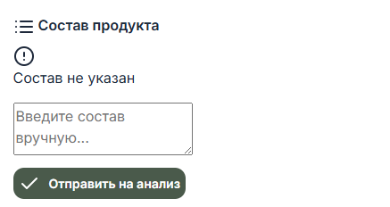

# BeautyCycle MVP - TODO List

## 1. Настройка проекта
- [x] Создать виртуальное окружение (`venv`/`poetry`) и установить зависимости
- [x] Создать структуру проекта:
``` 
Otrazhenie/
|_ app.py
|_ config.py
|_ analyzers/
|_ db/
|_ templates/
|_ static/
|_ tests/
```
- [x] Настроить PostgreSQL для проекта (создать базу `otrazhenie`, пользователя, пароль).
- [x] Настроить подключение через SQLAlchemy
- [x] Проверить запуск сервера `flask run`
- [ ] Заполнить `config.py`
- [ ] Сделать валидацию по Pydantic в `schemas.py`
- [ ] Рефакторинг `app/__init__.py`, который будет собирать приложение: загружает конфиг, подключает БД, регистрирует роуты
- [ ] Перенести бизнес-логику в `app/services/`
- [ ] Настроить маршруты в `app/routes`

## 1.2 Весь проект
- [x] Декомпозиция `main.py`: разделение функций по отдельным файлам
- [ ] Добавить логирование
- [ ] Добавить комментарии с описанием работы каждой функции и ее атрибутов
- [ ] Сделать админ панель, где будет отображение всех таблиц, работой с ними: добавление, удаление, обновление записей, просмотром всех пользователей

## 2. База данных
- [x] Создать таблицу `product_ingredients` в PostgreSQL для хранения ингредиентов
- [x] Создать таблицу `ingredient_categories` в PostgreSQL для хранения категория ингредиентов
- [x] Сделать скрипт импорта CSV `analyzers/inci_data.csv` в PostgreSQL.
- [x] Добавить функцию `select_one_ingredient(ingredient_name: str)` для поиска ингредиента по имени.
- [x] Заполнить `ProductIngredient` 
- [ ] Добавить функции в `crud.py` для операций над бд
- [ ] Рефакторинг под ООП
- [x] Сделать модели для таблиц работы с пользователями
- [ ] Создать таблицу `products`, в которой будут хранится те продукты, которые сканируются и обрабатываются

## 3. Сканер состава
- [x] Создать страницу `/` с формой загрузки штрих-кода и ручного ввода состава.
- [x] Реализовать `/handle-scan` для обработки изображений с декодированием штрих-кода через pyzbar.
- [ ] Отрефакторить `/handle-scan`  Страна: en:belarus, убрать en:
- [ ] Отрефакторить `/handle-scan` Категория fr:baume hydratant, убрать fr:
- [ ]  Отрефакторить `/handle-scan` Подогнать размеры для ситуации, когда состав продукта не указан
- [ ] Реализовать `/handle-search` для поиска продукта по названию.
- [ ] Реализовать `/manual-analysis` для ручного ввода состава.

## 4. Анализ ингредиентов
- [x] Сделать обработчик (view function) `results()` для Route (маршрута) `/results`
- [x] Функция разбора состава на ингредиенты и вытаскивания данных из БД.
- [x] Рендер таблицы с колонками: Название, Функция, Оценка безопасности, Описание.
- [x] Добавить цветовую индикацию (безопасно/умеренно/риск).
- [x] Добавить функционал добавления категори, когда она неизвестна
- [x] Отделить функции от main, вынести в отдельные файлы

## 5. История сканирований (дневник)
- [ ] Создать таблицу `user_products` (`id`, `user_id`, `product_id`, `scanned_at`).
- [ ] Добавлять запись при успешном анализе продукта.
- [ ] Страница `/diary` с историей сканирований.
- [ ] Возможность фильтрации по дате или рейтингу безопасности.

## 6. Базовый подбор продуктов
- [ ] Добавить поле `skin_type` для пользователей.
- [ ] Создать таблицу `product_recommendations` с указанием `skin_type`.
- [ ] Страница `/recommendations` с рекомендациями по типу кожи.
- [ ] Подбор продуктов по минимальному количеству рискованных ингредиентов.

## 7. Рекомендации безопасных аналогов
- [ ] Таблица `partner_products`: `id`, `name`, `brand`, `link`, `ingredients`.
- [ ] Функция подбора аналогов с совпадением ингредиентов ≥70%.
- [ ] Вывод списка с ссылками на магазины.

## 8. Тестирование
- [ ] Юнит-тесты:
- [ ] `decode_barcode`
- [ ] `get_ingredient`
- [ ] `manual_analysis` и парсинг состава
- [ ] Интеграционные тесты:
- [ ] POST формы `/handle-scan`, `/handle-search`, `/manual-analysis`
- [ ] GET страниц `/results`, `/diary`, `/recommendations`
- [ ] Проверка ошибок:
- [ ] Нет файла
- [ ] Пустой состав
- [ ] Продукт не найден

## 9. UI/UX
- [ ] Проверка отображения на разных устройствах (desktop, mobile).
- [ ] Flash-сообщения о статусе.
- [ ] Прогресс анализа и загрузки изображения.

## 10. Продакшн
- [ ] Настроить Gunicorn + Nginx.
- [ ] Перенести БД на удалённый сервер PostgreSQL.
- [ ] Настроить `.env` для секретов и ключей.
- [ ] Логирование ошибок и действий пользователей.
